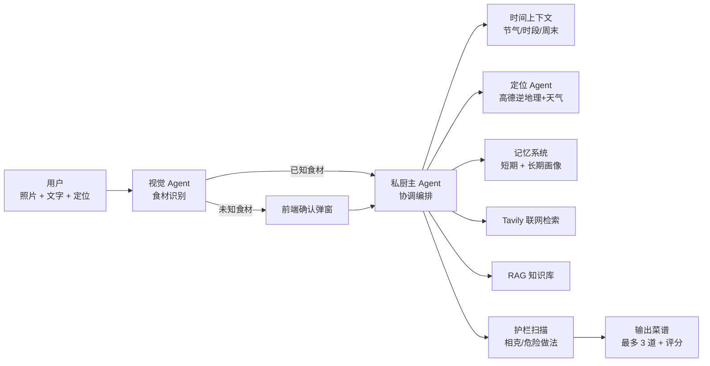

<div align="center">

# 🍳 私厨 · AppChef

**拍一张冰箱照片，AI 告诉你今天吃什么。**

一个会「记住你口味、避开你的过敏、知道当下节气」的个人智能私厨助手。

基于 **多模态视觉识别 + LangGraph 多智能体 + 长期记忆 + 联网检索 + RAG** 打造。

[](https://fastapi.tiangolo.com/)
[](https://www.langchain.com/)
[](https://nextjs.org/)
[](https://dashscope.aliyun.com/)
[](LICENSE)

</div>

---

## ✨ 核心特性

| 能力 | 说明 |
|------|------|
| 📷 **拍照识菜谱** | 上传冰箱/食材照片，多模态模型自动识别食材，未识别物品会主动向用户确认 |
| 🍲 **智能菜谱推荐** | 结合食材 + 节气 + 用餐时段 + 定位 + 用户画像，联网检索并打分排序，**最多推荐 3 道** |
| 🧠 **长期记忆** | 记住你的口味偏好、讨厌食材、过敏原；连续拒绝会触发「反思」，主动调整推荐策略 |
| 🛡️ **安全护栏** | 自动拦截食物相克（如西红柿+螃蟹）、危险做法（热油+冰块）、生食禽肉等风险 |
| 📍 **本地化推荐** | 接入高德地图，按所在城市推荐当地特色菜 |
| 📅 **节气与时段** | 内置二十四节气、用餐时段、周末/节日上下文，应季应时推荐 |
| 📚 **RAG 知识库** | 上传菜谱/营养文档（PDF/Word/TXT），向量 + BM25 混合检索问答 |
| 🔔 **节日提醒** | 定时任务自动推送节日/季节饮食建议 |

---

## 🧠 工作原理

系统采用「单主 Agent + 多协作者」的编排思路，各能力通过上下文注入主 Agent，而不是堆叠工具调用（控制成本）：



**关键设计**：

- **视觉 Agent**：单次多模态调用抽取食材，不进入主 Agent 工具循环，控制 token 成本。
- **反思机制**：用户连续拒绝菜谱时，反思 Agent 分析是「食材类别」「口味」还是「过敏」，把结论写入长期记忆，下次自动避雷。
- **记忆分层**：短期记忆（30 天对话，SQLite）+ 长期记忆（用户画像，带 Jaccard/向量去重）。
- **护栏后置**：在最终输出前扫描风险，而非限制模型生成。

---

## 🚀 快速开始

### 环境要求

- Python ≥ 3.10
- Node.js ≥ 18（构建前端）

### 1. 克隆并安装依赖

```bash
git clone <your-repo-url> appchef
cd appchef

# 后端依赖
pip install -r requirements.txt
```

### 2. 配置环境变量

在项目根目录创建 `.env` 文件：

```bash
# 通义千问（必需）
DASHSCOPE_API_KEY=sk-xxx
DASHSCOPE_BASE_URL=https://dashscope.aliyuncs.com/api/v1

# Tavily 联网搜索（必需）
TAVILY_API_KEY=tvly-xxx

# 高德地图（可选，用于定位推荐当地菜）
GAODE_KEY=xxx

# 阿里云 OSS（可选，用于图片上传）
OSS_ACCESS_KEY_ID=xxx
OSS_ACCESS_KEY_SECRET=xxx
OSS_BUCKET=your-bucket
OSS_ENDPOINT=oss-cn-beijing.aliyuncs.com
```

### 3. 启动后端

```bash
# 从 appchef 的父目录运行
python -m appchef.main
```

服务默认运行在 `http://127.0.0.1:8003`，前端已打包在 `appchef/static/`，直接访问即可。

> 也可以单独用 uvicorn 启动：`uvicorn appchef.main:app --host 127.0.0.1 --port 8003`

### 4. （可选）开发前端

前端源码在 `私厨-前端源码/`，基于 Next.js：

```bash
cd 私厨-前端源码
npm install
npm run dev        # 开发模式 http://localhost:3000
npm run build      # 构建后产物需复制到 appchef/static/
```

---

## 📡 API 接口

所有接口前缀为 `/api/v1`：

| 方法 | 路径 | 说明 |
|------|------|------|
| `POST` | `/chat/stream` | 流式对话（支持图片 + 定位） |
| `GET` | `/chat/messages` | 获取历史消息 |
| `DELETE` | `/chat/messages` | 清空历史消息 |
| `POST` | `/chat/feedback` | 菜谱反馈（reject / clarify / dislike） |
| `POST` | `/chat/confirm-ingredients` | 确认/修正食材后重新推荐 |
| `GET` | `/oss/presign` | 获取图片上传签名 URL |
| `POST` | `/rag/upload` | 上传知识文档（PDF/DOC/DOCX/TXT） |
| `POST` | `/rag/search` | RAG 混合检索 + 总结 |
| `GET` | `/rag/status` | RAG 状态（文档数/分块数） |
| `DELETE` | `/rag/document/{id}` | 删除文档 |
| `GET` | `/reminders/festival` | 获取节日/季节提醒 |
| `POST` | `/reminders/dismiss` | 关闭提醒 |
| `GET` / `POST` | `/reminders/settings` | 提醒设置 |

### 对话示例

```bash
curl -X POST http://127.0.0.1:8003/api/v1/chat/stream \
  -H "Content-Type: application/json" \
  -d '{
    "message": "家里有西红柿和鸡蛋，晚上吃什么？",
    "thread_id": "thread-001",
    "user_id": "default",
    "lon": 116.4074,
    "lat": 39.9042
  }'
```

---

## 📁 项目结构

```
appchef/
├── main.py                  # FastAPI 入口
├── agents/                  # 智能体
│   ├── personal_chief.py    #   私厨主 Agent（编排 + 记忆 + 护栏）
│   ├── vision_extract.py    #   视觉 Agent（食材识别）
│   └── reflection.py        #   反思 Agent（偏好提取）
├── api/v1/                  # API 路由
│   ├── chat.py              #   对话 + 反馈
│   ├── rag.py               #   RAG 检索
│   ├── reminders.py         #   节日提醒
│   └── oss.py               #   OSS 上传签名
├── services/                # 服务层
│   ├── vector_store.py      #   向量存储（SQLite + BM25 混合检索）
│   ├── rag_parser.py        #   文档解析
│   ├── rag_summarizer.py    #   RAG 总结
│   ├── scheduler.py         #   定时任务（APScheduler）
│   ├── time_context.py      #   节气/时段上下文
│   └── amap_client.py       #   高德地图
├── memory/
│   ├── store.py             #   短期 + 长期记忆（SQLite）
│   └── embedding_dashscope.py # 记忆向量化
├── guardrails/              # 安全护栏
│   ├── food_safety.py       #   食物相克
│   └── recipe_sanity.py     #   菜谱合理性
├── models/                  # Pydantic 数据模型
├── resources/               # 食材词库 + 数据库
├── static/                  # 前端静态产物（Next.js 构建）
└── 私厨-前端源码/           # 前端源码（Next.js 16）
```

---

## 🛠️ 技术栈

| 层 | 技术 |
|----|------|
| 后端框架 | FastAPI + Uvicorn |
| 智能体编排 | LangChain + LangGraph（SQLite checkpoint） |
| 大模型 | 通义千问 Qwen（DashScope，多模态 + 文本） |
| 联网检索 | Tavily Search |
| 向量存储 | SQLite + DashScope Embedding + BM25 混合检索 |
| 记忆 | SQLite（短期/长期记忆 + 去重） |
| 定时任务 | APScheduler |
| 地图/天气 | 高德开放平台 |
| 对象存储 | 阿里云 OSS |
| 前端 | Next.js 16 + React 19 + Tailwind CSS 4 |

---

## 📄 License

本项目采用 [MIT License](LICENSE) 开源。

---

<div align="center">

**如果这个项目对你有帮助，欢迎 ⭐ Star！**

</div>
